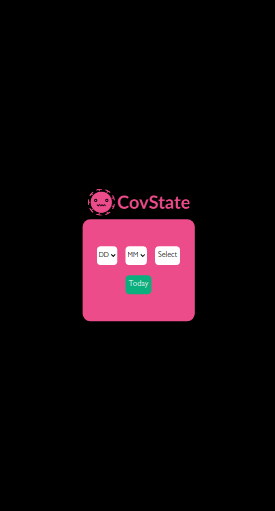
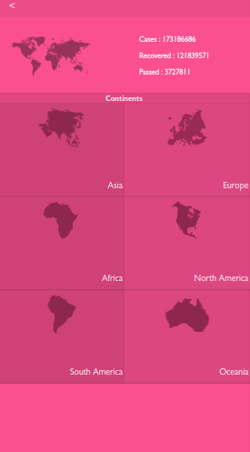
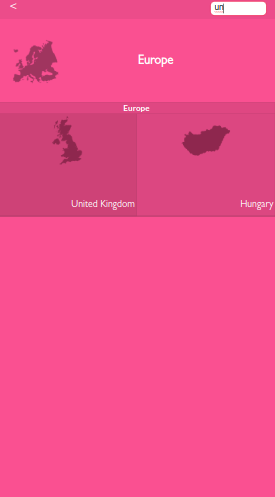

# Space Traveler's hub

The application provides commercial and scientific space travel services. The application will allow users to book rockets and join selected space missions.

## Built With

- HTML, CSS, JavaScript
- Reactjs, Redux

## Live Demo

[Netlify](https://space-travel-hub-amisai.netlify.app/)

## Getting Started

To get a local copy up and running follow these simple example steps.

### Prerequisites

- Zip archive manager if you are willing to [download](https://github.com/AmineHLub/space-travelers-hub/archive/refs/heads/dev.zip) directly from github.

- Git if you are planning to clone it.

- NodeJS

### Setup

- Access the project folder.

- Run npm i or npm install (to install all necessary dependencies).

### Install

- Run npm start to have a local server running the project.

## Authors

👤 **Isaí Céspedes Sánchez**

- GitHub: [@githubhandle](https://github.com/Lordkaito)
- Twitter: [@twitterhandle](https://twitter.com/Lordkaito_)
- LinkedIn: [LinkedIn](https://www.linkedin.com/in/isai-c%C3%A9spedes-4164a51b4/)

👤 **Mohamed Amine Hajltaief**

- GitHub: [@AmineHLub](https://github.com/AmineHLub)
- Twitter: [@Amino47612441](https://twitter.com/Amino47612441)
- LinkedIn: [LinkedIn](https://www.linkedin.com/in/mohamed-amine-hajltaief-b18863163/)

## 🤝 Contributing

Contributions, issues, and feature requests are welcome!

Feel free to check the [issues page](https://github.com/AmineHLub/space-travelers-hub/issues/).

## Show your support

Give a ⭐️ if you like this project!

## Acknowledgments

Adobe Sparks / world shapes

- This project belongs to [Microverse](https://microverse.org/).

## 📝 License

- This project is [MIT](./Licenses/MIT.md) licensed.
