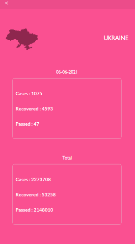

# CovState

This is a mobile web application that provides real time values of cases, recovered and passed covid patients around the world. Users at first will see the total number (all aroundn the world). they can also check for a specific country. If the list is too long users can search and filter for what they would like to choose.

## Built With

- HTML, CSS, JavaScript
- Reactjs, Redux

## Live Demo

[Netlify](https://covstate.netlify.app/)

## Getting Started

To get a local copy up and running follow these simple example steps.

### Prerequisites

- Zip archive manager if you are willing to [download](https://github.com/AmineHLub/react-capstone-app/archive/refs/heads/dev.zip) directly from github.

- Git if you are planning to clone it.

- NodeJS

### Setup

- Access the project folder.

- Run npm i or npm install (to install all necessary dependencies).

### Install

- Run npm start to have a local server running the project.

### Test

- Run npm test

## Authors

👤 **Mohamed Amine Hajltaief**

- GitHub: [@AmineHLub](https://github.com/AmineHLub)
- Twitter: [@Amino47612441](https://twitter.com/Amino47612441)
- LinkedIn: [LinkedIn](https://www.linkedin.com/in/mohamed-amine-hajltaief-b18863163/)

## 🤝 Contributing

Contributions, issues, and feature requests are welcome!

Feel free to check the [issues page](https://github.com/AmineHLub/space-travelers-hub/issues/).

## Show your support

Give a ⭐️ if you like this project!

## Acknowledgments

- Core design is [NelsonSakwa](https://www.behance.net/gallery/31579789/Ballhead-App-(Free-PSDs))'s
- Adobe Sparks for the creation of logo.
- Huge shoutouts to @djaiss for his [mapsicon](https://github.com/djaiss/mapsicon) repository.
- Acknowledgment to [BeardDesign](https://dribbble.com/BeardDesign) for the loading animation
even though I changed it abit the main core design is his.
- This project belongs to [Microverse](https://microverse.org/).

## 📝 License

- This project is [MIT](./Licenses/MIT.md) licensed.
- [Adobe](./Licenses/ADOBE.md) personal non-commercial use.
